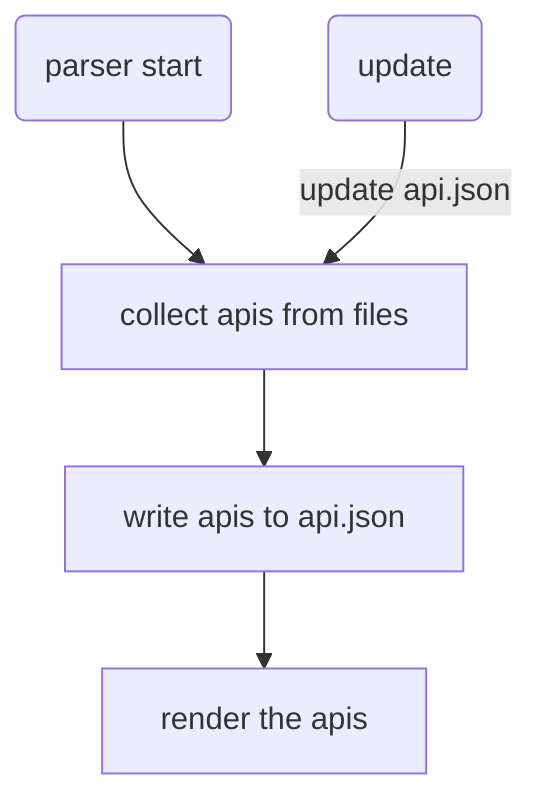

# Api Parser

## Flowchart

```mermaid
graph TB
  start(parser start)  --> collect[collect apis from files]

  collect --> write[write apis to api.json]

  write --> render[render the apis]

  update(update) -- "update api.json" --> collect
```
